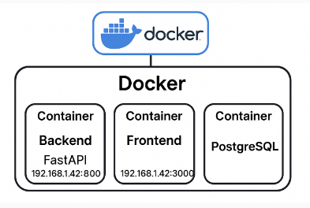

# README.md

# WaterLevel Project

**WaterLevel** is a telemetry system designed to monitor and visualize the movement of angle-controlled robots. It provides real-time tracking, deviation analysis, and projected arrival point visualization through a secure web dashboard.

---

## 🚀 Features

- Real-time UART data streaming and visualization
- Role-based access control (Admin, Operator, Viewer)
- Job configuration and robot path projection
- Audit logging and printable PDF reports
- Secure access over local network and internet
- Modular backend (FastAPI) and frontend (Next.js + TypeScript)
- PostgreSQL database integration

---

## 🧱 Project Structure

```
WaterLevel/
├── backend/       # FastAPI backend
├── frontend/      # Next.js frontend
├── docker-compose.yml
├── README.md
└── .gitignore
```

```
WaterLevel/
├── backend/       # FastAPI backend
├── Dockerfile
│ ├── requirements.txt
│ ├── main.py
│ ├── models/
│ │ ├── init.py
│ │ ├── base.py
│ │ ├── user.py
│ │ ├── device.py
│ │ ├── telemetry.py
│ │ ├── audit_log.py
│ │ └── report.py
│ ├── database.py
│ ├── .env
│ └── ...
├── frontend/      # Next.js frontend
├── Dockerfile
│ ├── package.json
│ ├── tsconfig.json
│ ├── .env.local
│ └── ...
├── docker-compose.yml
├── README.md
└── .gitignore
```

---

## ⚙️ Technologies

- **Backend**: FastAPI, SQLAlchemy, WebSockets, pyserial, python-dotenv
- **Frontend**: Next.js, TypeScript, Recharts
- **Database**: PostgreSQL (recommended v16)
- **Deployment**: Docker & Docker Compose
- **Dev Tools**: VSCode, Git, GitHub CLI

# WaterLevel Project – Environment Setup Checklist

## 1. Prerequisites

- [ ] Windows 10/11 with admin rights
- [ ] Internet access

## 2. Core Software

- [ ] Python 3.10+ (add to PATH)
- [ ] Node.js (LTS, e.g., 18.x+) and npm
- [ ] PostgreSQL (15+)
- [ ] Docker Desktop (enable WSL2 if prompted)
- [ ] Visual Studio Code
- [ ] Git & GitHub CLI

## 3. VSCode Extensions

- [ ] Python
- [ ] Pylance
- [ ] Docker
- [ ] Prettier
- [ ] ESLint
- [ ] GitHub Copilot (optional)

## 4. Project Repository

- [ ] Clone the repo: `git clone <repo-url>`
- [ ] Confirm backend and frontend folders exist
- [ ] Check `.gitignore` for secrets/build artifacts

## 5. Python Backend

- [ ] `cd backend`
- [ ] `python -m venv venv`
- [ ] `venv\Scripts\activate`
- [ ] `pip install -r requirements.txt`

## 6. Frontend

- [ ] `cd ../frontend`
- [ ] `npm install`
- [ ] `npm run build`
- [ ] Confirm `tsconfig.json` exists

## 7. Database

- [ ] Start PostgreSQL service
- [ ] Create database: `createdb waterlevel`
- [ ] (Optional) Set up initial tables

## 8. Docker

- [ ] Ensure Docker Desktop is running
- [ ] `docker-compose build`
- [ ] `docker-compose up`
- Backend accessible at: http://localhost:8000/docs
- Frontend accessible at: http://localhost:3000
- use ipconfig to get the ip adress and you can access from that IP

## 9. GitHub Integration

- [ ] `gh auth login`
- [ ] Test push/pull

## 10. Documentation

- [ ] Update `README.md`
- [ ] Add onboarding checklist for new contributors

# Technical Details for Contributors

## Backend (FastAPI)

- Entry point: main.py with app = FastAPI()
- Models: Organized in models/ for maintainability
- Database: SQLAlchemy ORM, connection via database.py
- Environment variables: Use .env for secrets and DB connection string
- Serial communication: pyserial for UART data
- Audit logging: Implemented via SQLAlchemy models

## Frontend (Next.js)

- Entry point: pages/index.tsx
- TypeScript: Strict typing enforced via tsconfig.json
- Charts: Recharts for data visualization
- API calls: Use environment variables in .env.local for backend endpoints
- Build: Production build with npm run build

## Docker & Compose

- Backend Dockerfile: Installs dependencies, copies code, exposes port 8000, starts FastAPI via Uvicorn
  Frontend Dockerfile: Installs dependencies, builds production assets, exposes port 3000, starts Next.js
  docker-compose.yml: Orchestrates backend, frontend, and PostgreSQL containers; sets up volumes for persistent DB data

## Database

- PostgreSQL: Use official Docker image (recommended v16)
  DB user/password: Set via environment variables in docker-compose.yml
  Initial schema: Can be set up via SQLAlchemy models or SQL scripts

## Git & Version Control

- .gitignore: Exclude node_modules/, .env, **pycache**/, \*.pyc, .next/, venv/
  Branching: Use feature branches for new features/bugfixes
  Commits: Write clear, descriptive commit messages

# 🔐 Authentication Overview

- This project uses JWT-based authentication with a FastAPI backend and a React/Next.js frontend.

## Backend

- Login endpoint validates credentials and returns a JWT token.
  Passwords are hashed using bcrypt.
  JWT tokens include user (username) and exp (expiration).
  CORS is enabled for frontend communication.

## Frontend

- Login page sends credentials to backend and stores token in localStorage.
  Dashboard page decodes token, validates expiration, and displays user info.
  Logout clears token and redirects to login.

# Onboarding Guide

Welcome to the WaterLevel Telemetry Project!

## 1. Get Access

- Request access to the GitHub repo and SharePoint docs.
- Join project communication channels.

## 2. Set Up Your Environment

- Follow the Environment Setup Checklist above.
- For issues, check README troubleshooting or ask in team chat.

## 3. Understand the Project Structure

- Review backend, frontend, and shared config folders.
- Read the BRD and technical docs (see SharePoint links in README).

## 4. First Run

- Start PostgreSQL and Docker Desktop.
- Run backend and frontend locally (via Docker or directly).
- Open the dashboard in your browser and log in.

## 5. Development Workflow

- Create a new branch for your feature/bugfix.
- Commit changes with clear messages.
- Push to GitHub and open a pull request.
- Request code review.

## 6. Best Practices

- Use VSCode with recommended extensions.
- Keep `.env` files out of version control.
- Write clear, concise commit messages.
- Document new scripts or dependencies.

## 7. Support

- For onboarding help, contact the project lead or check the README.
- For technical issues, open a GitHub issue or ask in the team chat.

## 📄 License

This project is licensed for internal use and prototyping. Contact the author for deployment or commercial use.

---

## Troubleshooting

    -  Runing scripta : Set-ExecutionPolicy -Scope CurrentUser -ExecutionPolicy RemoteSigned
    -  Remove permission: Set-ExecutionPolicy -Scope CurrentUser -ExecutionPolicy Restricted

## 🩺 Troubleshooting Table

| Issue                                                                                  | Solution                                                                               |
| -------------------------------------------------------------------------------------- | -------------------------------------------------------------------------------------- |
| Docker build fails at pip install                                                      | Remove invalid lines from `requirements.txt` (e.g., `// # requirements.txt`)           |
| PostgreSQL container exits with version error                                          | Run `docker-compose down -v` to remove old volumes, then restart                       |
| Backend container exits: "Could not import module 'main'"                              | Ensure `main.py` exists and defines `app = FastAPI()`                                  |
| Frontend container exits: "Could not find a production build in the '.next' directory" | Add `RUN npm run build` to Dockerfile, or run `npm run build` manually                 |
| VSCode Dockerfile warning: "No source image provided with FROM"                        | Ignore if `FROM node:18` is present and build works                                    |
| PowerShell script execution policy error                                               | Run `Set-ExecutionPolicy -Scope CurrentUser -ExecutionPolicy RemoteSigned`             |
| Port conflicts                                                                         | Make sure ports 8000 (backend) and 3000 (frontend) are free before starting containers |
| Environment variable issues                                                            | Ensure `.env` and `.env.local` files are present and correctly configured              |
| Database connection errors                                                             | Check DB credentials and connection string in backend `.env` and `docker-compose.yml`  |

## 🐳 Docker & Database Initialization – Technical Reference

| Step / Purpose                  | Command / File / Script                               | What It Does / Sample Comments                                                                    |
| ------------------------------- | ----------------------------------------------------- | ------------------------------------------------------------------------------------------------- |
| Clean Up Old Containers/Volumes | `docker-compose down -v`                              | Stops all containers and removes volumes. Use before switching DB versions or fixing DB errors.   |
| Build Images                    | `docker-compose build`                                | Builds Docker images for backend, frontend, and database. Re-run after changing Dockerfiles.      |
| Start All Services              | `docker-compose up --build`                           | Builds (if needed) and starts all containers. Use after initial setup or any major config change. |
| Check Running Containers        | `docker ps`                                           | Lists running containers. Confirm backend, frontend, and db are “Up”.                             |
| View Logs                       | `docker-compose logs backend` / `frontend` / `db`     | Shows logs for each service. Use to diagnose startup or runtime errors.                           |
| Remove Unused Docker Data       | `docker system prune -af`                             | Cleans up unused images, containers, and volumes. Use if disk space is low or builds are failing. |
| Backend Dockerfile              | `backend/Dockerfile`                                  | Defines backend build steps. Ensure `main.py` is present and `requirements.txt` is valid.         |
| Frontend Dockerfile             | `frontend/Dockerfile`                                 | Defines frontend build steps. Must include `RUN npm run build` for production.                    |
| Compose File                    | `docker-compose.yml`                                  | Orchestrates multi-container setup. Set correct image versions and environment variables.         |
| Database Initialization         | `createdb waterlevel`                                 | Creates the PostgreSQL database. Run inside the db container or on host if using local DB.        |
|                                 | `init.sql`                                            | SQL script to initialize tables/schema. Place in `/docker-entrypoint-initdb.d/` for auto-run.     |
|                                 | `psql -U <user> -d waterlevel -f init.sql`            | Runs SQL script to set up schema. Use after DB creation for initial setup.                        |
| Sample DB Initialization        | See below                                             | Example SQL for telemetry table.                                                                  |
|                                 | ```sql                                                |                                                                                                   |
|                                 | -- Create tables for telemetry data                   |                                                                                                   |
|                                 | CREATE TABLE telemetry (                              |                                                                                                   |
|                                 | id SERIAL PRIMARY KEY,                                |                                                                                                   |
|                                 | device_id INTEGER,                                    |                                                                                                   |
|                                 | timestamp TIMESTAMP,                                  |                                                                                                   |
|                                 | value FLOAT                                           |                                                                                                   |
|                                 | );                                                    |                                                                                                   |
|                                 | -- Add more tables as needed                          |                                                                                                   |
|                                 | ```                                                   |                                                                                                   |
| Troubleshooting DB Version      | Edit `docker-compose.yml` to set `image: postgres:16` | Ensures DB container matches expected version. Remove old volumes if switching versions.          |
| Environment Variables           | `.env` (backend), `.env.local` (frontend)             | Store secrets and connection strings. Never commit these files to version control.                |
| Port Mapping                    | `docker-compose.yml`                                  | Map ports (e.g., `8000:8000`, `3000:3000`, `5432:5432`). Ensure ports are free before starting.   |

### ⚙️ Setup Commands & Scripts (Technical Reference)

| Purpose             | Script/Command                                                            | What It Does / Notes                                                               |
| ------------------- | ------------------------------------------------------------------------- | ---------------------------------------------------------------------------------- |
| System Preparation  | `Set-ExecutionPolicy -Scope CurrentUser -ExecutionPolicy RemoteSigned`    | Allows running PowerShell scripts (required for automation on Windows)             |
| System Preparation  | `Set-ExecutionPolicy -Scope CurrentUser -ExecutionPolicy Restricted`      | Reverts PowerShell script permissions to default                                   |
| Repo Initialization | `git clone`                                                               | Clones the project repository from GitHub                                          |
| Repo Initialization | `git init`                                                                | Initializes a local Git repository                                                 |
| Repo Initialization | `git add . / git commit -m "..."`                                         | Stages and commits changes to local repo                                           |
| Repo Initialization | `git remote add origin`                                                   | Links local repo to remote GitHub                                                  |
| Repo Initialization | `git push -u origin main`                                                 | Pushes local commits to GitHub                                                     |
| Repo Initialization | `gh auth login`                                                           | Authenticates GitHub CLI for push/pull operations                                  |
| Backend Setup       | `python -m venv venv`                                                     | Creates a Python virtual environment in the backend folder                         |
| Backend Setup       | `venv\Scripts\activate (Windows) or source venv/bin/activate (Linux/Mac)` | Activates the virtual environment for dependency isolation                         |
| Backend Setup       | `pip install -r requirements.txt`                                         | Installs backend dependencies (FastAPI, SQLAlchemy, etc.)                          |
| Backend Setup       | `python main.py or uvicorn main:app --reload`                             | Runs FastAPI backend locally for development                                       |
| Backend Setup       | `main.py`                                                                 | Entry point for FastAPI app; must define app = FastAPI()                           |
| Backend Setup       | `.env`                                                                    | Stores backend environment variables (DB connection string, secrets)               |
| Frontend Setup      | `cd frontend`                                                             | Navigates to frontend folder                                                       |
| Frontend Setup      | `npm install`                                                             | Installs frontend dependencies (Next.js, TypeScript, Recharts, etc.)               |
| Frontend Setup      | `npm run build`                                                           | Builds frontend for production; generates .next directory                          |
| Frontend Setup      | `npm run dev`                                                             | Runs frontend in development mode (hot reload)                                     |
| Frontend Setup      | `.env.local`                                                              | Stores frontend environment variables (API endpoints, secrets)                     |
| Frontend Setup      | `tsconfig.json`                                                           | TypeScript configuration for frontend                                              |
| Database Setup      | `createdb waterlevel`                                                     | Creates PostgreSQL database named waterlevel                                       |
| Database Setup      | `psql --version`                                                          | Verifies PostgreSQL installation and version                                       |
| Database Setup      | `init.sql`                                                                | (Optional) SQL script to initialize tables/schema                                  |
| Database Setup      | `pgAdmin`                                                                 | (Optional) GUI for managing PostgreSQL database                                    |
| Docker Setup        | `docker-compose build`                                                    | Builds Docker images for backend, frontend, and database                           |
| Docker Setup        | `docker-compose up --build`                                               | Builds and starts all containers; runs backend, frontend, and db together          |
| Docker Setup        | `docker-compose down -v`                                                  | Stops containers and removes volumes (fixes DB version mismatch issues)            |
| Docker Setup        | `docker ps`                                                               | Lists running containers and their status                                          |
| Docker Setup        | `docker-compose logs`                                                     | Shows logs for a specific service (backend, frontend, db)                          |
| Docker Setup        | `Dockerfile (backend/frontend)`                                           | Defines build steps for backend/frontend containers                                |
| Docker Setup        | `docker-compose.yml`                                                      | Orchestrates multi-container setup and networking                                  |
| Troubleshooting     | `Remove invalid lines from requirements.txt`                              | Fixes pip install errors during Docker build (no comments or non-package lines)    |
| Troubleshooting     | `Add RUN npm run build to frontend Dockerfile`                            | Ensures Next.js production build is available in container                         |
| Troubleshooting     | `Ensure main.py exists and defines app = FastAPI()`                       | Fixes backend container import errors                                              |
| Troubleshooting     | `Check .env and .env.local files`                                         | Ensures environment variables are set for backend/frontend                         |
| Troubleshooting     | `Free up ports 8000/3000`                                                 | Resolves port conflicts before starting containers                                 |
| Troubleshooting     | `docker system prune -af`                                                 | Cleans up unused Docker images, containers, and volumes (advanced troubleshooting) |
| Troubleshooting     | `Update requirements.txt, package.json, tsconfig.json`                    | Ensures dependencies and configs are correct for build and runtime                 |
| Troubleshooting     | `Check PostgreSQL version in docker-compose.yml`                          | Ensures DB container version matches expected schema/data                          |
| Troubleshooting     | `Use gh CLI for GitHub operations`                                        | Simplifies authentication and repo management                                      |

- Here’s a diagram showing how Docker runs your backend and frontend services for the WaterLevel project:

🧩 Diagram Overview
- Docker Host (Your Machine)
Runs Docker Engine and manages containers.

- Docker Compose
Orchestrates multiple services:

- Backend Container: Runs FastAPI with Uvicorn, exposes port 8000.
- Frontend Container: Runs Next.js, exposes port 3000.
- Database Container: Runs PostgreSQL, exposes port 5432.
- Networking
- All containers are connected via a shared Docker network, allowing internal communication (e.g., backend ↔ database).

- External Access
- You can access:

- http://<your-ip>:8000/docs → Swagger UI (FastAPI)
- http://<your-ip>:3000 → Frontend dashboard

# 🧱 Database & Core Services Setup

This module connects the backend to a PostgreSQL database using SQLAlchemy. It includes session management, model definitions, and basic connectivity tests.

## ✅ Prerequisites

- Python 3.11+
  PostgreSQL running locally or via Docker
  .env file with DATABASE_URL

## 🛠️ Setup Steps

Install dependencies: pip install -r requirements.txt
Ensure .env is configured with your DB credentials.
Run the app: uvicorn app.main:app --reload --port 8001
Visit /db-test to confirm DB connectivity.

## 📂 Key Files

app/models/database.py: SQLAlchemy engine and session setup
app/dependencies.py: DB session injection
app/models/\*.py: ORM models
app/main.py: FastAPI app entry point

# 🔒 RBAC Config Lock Feature
The WaterLevel telemetry dashboard supports exclusive configuration mode to ensure safe and coordinated updates:

Who can lock?
## Only users with Admin or Operator roles can initiate configuration mode.

## How does it work?
When configuration mode is activated, all other users are temporarily blocked from accessing configuration panels. A notification banner displays who is currently configuring.

## How is the lock released?
The lock is released when the locker saves their changes, restoring access to all users.

## What happens if the locker disconnects?
The system may implement a timeout or allow another Admin to force unlock (optional for MVP).

## Audit Logging
All configuration lock/unlock actions will be recorded for future auditing.

## Endpoints:

POST /api/config/lock — Initiate configuration lock
POST /api/config/unlock — Release configuration lock
GET /api/config/status — Check current lock status
## Frontend Integration:

Dashboard panels check lock status before allowing configuration.
Non-locking users see a notification and cannot edit until the lock is released.

## 👤 Author

**Dorel Dumencu**
